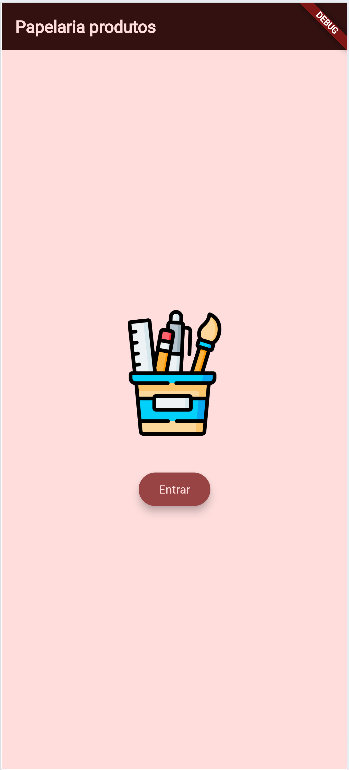
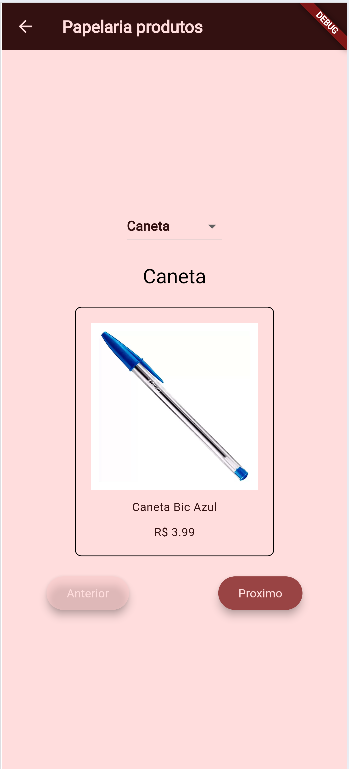
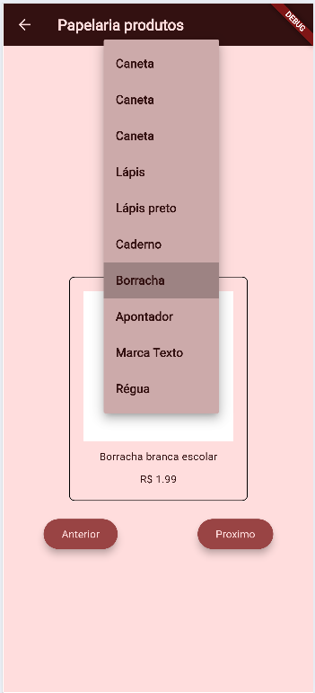

# Produtos
Exemplo de um app flutter que **abre dados Mockup** JSON, uma lista de produtos de papelaria.<br>Exemplo de arquivos de estilização com paleta de cores e tema.

## Tecnologias
- Flutter
- VsCode
- Android Studio

|Efeitos|WidGets|
|-|:-:|
|Tema|ThemeData.light().copyWith()|
|Imagens|Image.asset()|
|Assincronicidade|async|
|Carregar arquivos texto locais|rootBundle.loadString('assets/..');|
|Conversão de dados|json.encode(), json.decode()|
|Menu dropDown "Select"|DropdownButton<dynamic>()|
|Botões de controle de conteúdos em tela|ElevatedButton()|

||||
|:-:|:-:|:-:|
|Splash|Home|Menu|

# Para testar
- 1 Clone o repositório
- 2 Abra com VsCode, Abra o trminal **CTRL + "**, execute o comando `flutter pub get` para instalar as dependências
- 3 Navegue até o arquivo lib/main.dart e dê **play** ou execute o comando `flutter run` para rodar o projeto
- 4 Escolha navegador ou um emulador para testar
- O projeto irá abrir a tela de Splash com uma animação, preencha seu nome e clique em entrar.

## Aividades
Crie um novo aplicativo chamado "flutter_funcionarios" que renderize com um menu dropDown o arquivo de Modkup funcionarios.jason contendo os dados abaixo:
- funcionarios.json
```json
[
  {
    "id": 1,
    "nome": "Mariana Souza",
    "cargo": "Atendente",
    "salario": 1850.50,
    "dataContatacao": "2022-03-15"
  },
  {
    "id": 2,
    "nome": "Carlos Pereira",
    "cargo": "Lavador",
    "salario": 2100.00,
    "dataContatacao": "2021-11-02"
  },
  {
    "id": 3,
    "nome": "Fernanda Lima",
    "cargo": "Passadeira",
    "salario": 1950.75,
    "dataContatacao": "2023-01-20"
  },
  {
    "id": 4,
    "nome": "João Batista",
    "cargo": "Gerente",
    "salario": 3500.00,
    "dataContatacao": "2020-08-10"
  },
  {
    "id": 5,
    "nome": "Aline Rocha",
    "cargo": "Auxiliar de Lavanderia",
    "salario": 1700.00,
    "dataContatacao": "2024-02-05"
  },
  {
    "id": 6,
    "nome": "Ricardo Alves",
    "cargo": "Motorista",
    "salario": 2200.30,
    "dataContatacao": "2022-07-18"
  },
  {
    "id": 7,
    "nome": "Patrícia Gomes",
    "cargo": "Atendente",
    "salario": 1820.00,
    "dataContatacao": "2023-06-12"
  },
  {
    "id": 8,
    "nome": "Eduardo Martins",
    "cargo": "Técnico de Manutenção",
    "salario": 2800.90,
    "dataContatacao": "2021-04-25"
  },
  {
    "id": 9,
    "nome": "Juliana Freitas",
    "cargo": "Passadeira",
    "salario": 2000.00,
    "dataContatacao": "2022-09-30"
  },
  {
    "id": 10,
    "nome": "Lucas Ribeiro",
    "cargo": "Auxiliar de Lavanderia",
    "salario": 1750.60,
    "dataContatacao": "2024-05-14"
  }
]
```
- No JSON acima acrescente um campo **"avatar":"",** e pesquise imagens na web copiando o endereço das imagens para preencher.
- O App deve ter duas telas, uma Splash com algum efeito de movimento e uma tela Home que carregue os usuários e navegue entre eles uma a um.
- Altere a estilização, paleta de cores e Widgets

## Entregas
crie um repositório público do github e hospede com prints das telas, tecnologias e instruções de como testar em README.md conforme este exemplo. Apresente ao seu professor.
